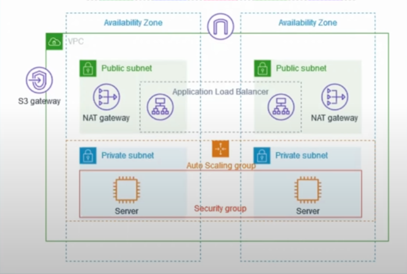

# AWS Terraform Secure Architecture



This project is aimed at creating a highly secure and highly available network infrastructure on AWS using Terraform. The main goals are to ensure robust security and high availability of the infrastructure.

Deploying the architecture shown in the image using Terraform involves several steps, creating resources such as VPC, subnets, route tables, NAT gateways, security groups, an auto-scaling group, and a load balancer. Below are the high-level steps and corresponding Terraform resources required:

## High-Level Steps:
1. Set up a VPC.
2. Create public and private subnets in two availability zones.
3. Create Internet Gateway and route tables for public subnets.
4. Create NAT Gateways in public subnets.
5. Create route tables for private subnets and associate them with NAT Gateways.
6. Set up an Application Load Balancer in public subnets.
7. Create security groups for the load balancer and the servers.
8. Set up an Auto Scaling group with EC2 instances in private subnets.
9. Create an S3 gateway endpoint.

## Project Goals

1. **Highly Secure Network Infrastructure (VPC)**:
   - Design and implement a Virtual Private Cloud (VPC) that isolates resources and controls network traffic to enhance security.

2. **Highly Available Infrastructure**:
   - Ensure that the infrastructure is resilient and available at all times by leveraging AWS services and best practices for high availability.

3. **Tight Security**:
   - Implement tight security measures to protect the infrastructure from potential threats and vulnerabilities.

## Technologies Used

- **AWS**: The primary cloud service provider for hosting the infrastructure.
- **Terraform**: The infrastructure as code tool used to provision and manage the AWS resources.

## Getting Started

### Prerequisites

- [Terraform](https://www.terraform.io/downloads.html) installed on your local machine.
- AWS account with necessary permissions to create and manage resources.
- AWS CLI configured with your credentials.

### Installation

1. **Clone the repository**:
   ```sh
   git clone https://github.com/Tonysysop/Aws-Terraform-Secure-Achitecture.git
   cd Aws-Terraform-Secure-Achitecture
